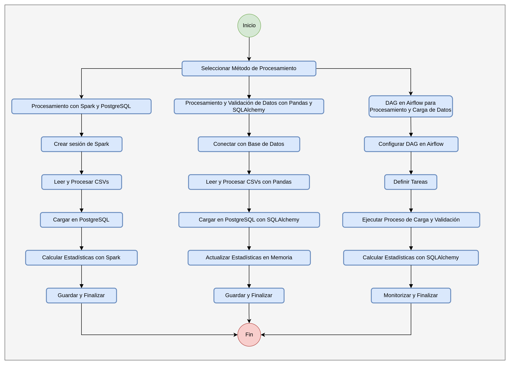
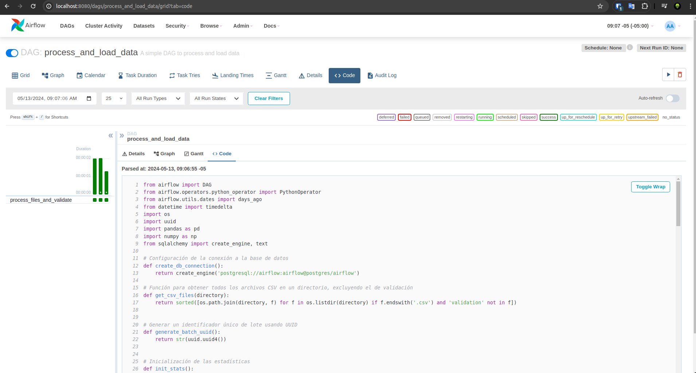

# Pipeline de Procesamiento de Datos
En el siguiente repositorio he explorado tres enfoques distintos para el procesamiento y la carga de datos, cada uno utilizando diferentes herramientas y frameworks.

1. **[Procesamiento de Datos con Spark y PostgreSQL](jupyter/pipeline_spark.ipynb)**
   - **Descripción:** Utiliza Apache Spark para el procesamiento distribuido de grandes conjuntos de datos y PostgreSQL para la persistencia de datos.
   - **Implementación:** Jupyter Notebook.

2. **[Procesamiento y Validación de Datos con Pandas y SQLAlchemy](jupyter/pipeline.ipynb)**
   - **Descripción:** Emplea Pandas para la manipulación de datos y SQLAlchemy para interactuar con bases de datos PostgreSQL.
   - **Implementación:** Jupyter Notebook.

3. **[DAG en Airflow para Procesamiento y Carga de Datos](dags/data_load_pipeline.py)**
   - **Descripción:** Usa Airflow para definir y gestionar DAGs que orquestan el procesamiento y la carga de datos.
   - **Implementación:** Apache airflow y Docker.



Estructura del repositorio:
```
data-processing-pipeline/
├── config/
│   └── .gitkeep
├── dags/
│   └── data_load_pipeline.py
├── driver/
│   └── postgresql-42.7.3.jar
├── input/
│   ├── 2012-1.csv
│   ├── 2012-2.csv
│   ├── 2012-3.csv
│   ├── 2012-4.csv
│   ├── 2012-5.csv
│   └── validation.csv
├── jupyter/
│   ├── pipeline_spark.ipynb
│   └── pipeline.ipynb
├── logs/
├── output/
├── plugins/
│   └── .gitkeep
├── tmp/
│   └── image-1.png
│   └── image.png
├── .env
├── .gitignore
├── .python-version
├── docker-compose.yaml
├── Dockerfile
├── README.md
└── requirements.txt
```

## 1. Procesamiento de Datos con Spark y PostgreSQL

### Descripción General
Este script utiliza Apache Spark para procesar archivos CSV almacenados en un directorio, calcular estadísticas de los datos y almacenarlos en una base de datos PostgreSQL. Es ideal para manejar grandes volúmenes de datos distribuidos y realizar operaciones complejas de agregación y carga de datos.

### Componentes del Script

#### **Función `create_spark_session`:**
   - Inicia una sesión de Spark configurada para interactuar con una base de datos PostgreSQL mediante el uso de un driver específico.

#### **Función `get_csv_files`:**
   - Enumera y filtra archivos CSV en un directorio especificado, excluyendo aquellos que contienen la palabra 'validation' en su nombre.

#### **Función `load_data_and_update_stats`:**
   - Lee un archivo CSV utilizando Spark, agrega metadatos como el nombre del archivo y un UUID de lote.
   - Calcula el tamaño del archivo y registra estos datos junto con el contenido del archivo en la base de datos PostgreSQL.

#### **Función `aggregate_stats`:**
   - Realiza cálculos estadísticos sobre los datos cargados, como la suma, el promedio, el mínimo, el máximo y el conteo de los precios.

#### **Función `process_files_and_validate`:**
   - Orquesta el proceso completo desde la creación de la sesión de Spark, carga de archivos, hasta la validación final utilizando un archivo de validación específico.
   - Combina todos los datos procesados y calcula estadísticas finales después de la validación.

#### **Ejecución del proceso:**
   - Define el directorio de entrada y el archivo de validación.
   - Llama a `process_files_and_validate` para iniciar el procesamiento de los archivos y recopila las estadísticas finales.


## 2. Procesamiento y Validación de Datos con Pandas y SQLAlchemy

### Descripción General
Este script utiliza Pandas para la carga y manipulación de datos desde archivos CSV, y SQLAlchemy para interactuar con una base de datos PostgreSQL. Se centra en el procesamiento eficiente de archivos de datos, cálculo de estadísticas en memoria y su sincronización con estadísticas almacenadas en base de datos.

### Componentes del Script

#### **Función `create_db_connection`:**
   - Establece una conexión con la base de datos PostgreSQL utilizando SQLAlchemy.

#### **Función `get_csv_files`:**
   - Busca y lista todos los archivos CSV en un directorio dado, excluyendo archivos de validación.

#### **Función `generate_batch_uuid`:**
   - Genera un UUID único para cada lote de procesamiento, facilitando el seguimiento de cargas de datos.

#### **Función `init_stats`:**
   - Inicializa un diccionario de estadísticas que mantendrá el conteo, suma, mínimo, máximo y promedio de precios.

#### **Función `update_stats_buffer_memory`:**
   - Actualiza las estadísticas en memoria con los datos de un nuevo archivo CSV procesado.

#### **Función `load_data_and_update_stats`:**
   - Carga datos desde un archivo CSV a un DataFrame de Pandas, añade metadatos y los carga en la base de datos PostgreSQL.
   - Actualiza las estadísticas en memoria después de cada carga.

#### **Función `query_stats_sql`:**
   - Ejecuta una consulta SQL para obtener estadísticas acumuladas directamente desde la base de datos.

#### **Función `process_files_and_validate`:**
   - Orquesta el proceso completo: desde la conexión con la base de datos, procesamiento de archivos, hasta la validación utilizando un archivo específico.
   - Combina todas las estadísticas en memoria y contrasta con las estadísticas finales de la base de datos.

#### **Ejecución del Proceso:**
   - Define el directorio de entrada y el archivo de validación.
   - Ejecuta `process_files_and_validate` para procesar los archivos y obtener las estadísticas finales.


## 3. DAG en Airflow para Procesamiento y Carga de Datos

### Descripción General
Este DAG en Airflow está diseñado para automatizar el procesamiento y la carga de archivos CSV en una base de datos PostgreSQL. Utiliza funciones definidas en Python para manipular datos, calcular estadísticas y sincronizar con la base de datos.

### Componentes del DAG

#### **Configuración de la Conexión a la Base de Datos:**
   - Utiliza SQLAlchemy para establecer conexiones a una base de datos PostgreSQL.

#### **Funciones Utilizadas:**
   - **`get_csv_files`:** Busca archivos CSV en un directorio especificado, excluyendo los de validación.
   - **`generate_batch_uuid`:** Genera un UUID único para cada lote de procesamiento.
   - **`init_stats`:** Inicializa un diccionario de estadísticas para seguimiento de los datos procesados.
   - **`update_stats_buffer_memory`:** Actualiza las estadísticas en memoria basadas en los datos de un nuevo archivo.
   - **`load_data_and_update_stats`:** Carga datos desde un archivo CSV, añade metadatos y los carga en PostgreSQL, actualizando las estadísticas.
   - **`query_stats_sql`:** Consulta estadísticas de la base de datos al finalizar la carga de todos los archivos.
   - **`process_files_and_validate`:** Procesa todos los archivos y realiza una validación usando un archivo específico de validación.

#### **Parámetros del DAG:**
   - **Propietario:** 06danielsms
   - **Dependencias de Tareas Pasadas:** No depende de la ejecución exitosa de tareas anteriores.
   - **Fecha de Inicio:** Un día antes de la definición del DAG.
   - **Reintentos:** No se realizan reintentos en caso de fallo.
   - **Intervalo de Programación:** Se ejecuta manualmente (no hay programación automática).

#### **Tareas del DAG:**
   - **`process_files_and_validate`:** Tarea que encapsula la función principal para procesar y validar los archivos. Utiliza argumentos para especificar el directorio de entrada y el archivo de validación.

#### Ejecución y Monitoreo
- El DAG se maneja a través de la interfaz de usuario de Airflow, donde se pueden monitorear las ejecuciones, revisar logs y gestionar fallos.
- Los resultados de las estadísticas procesadas se muestran en la consola durante la ejecución, lo que facilita el seguimiento en tiempo real del procesamiento.


#### Prerequisitos

- https://docs.docker.com/engine/install/ubuntu/

#### Despliegue

```sh
docker compose up
```

```sh
docker compose up -d
```

```sh
docker compose restart
```

```sh
docker compose down
```

```sh
docker compose build
```

